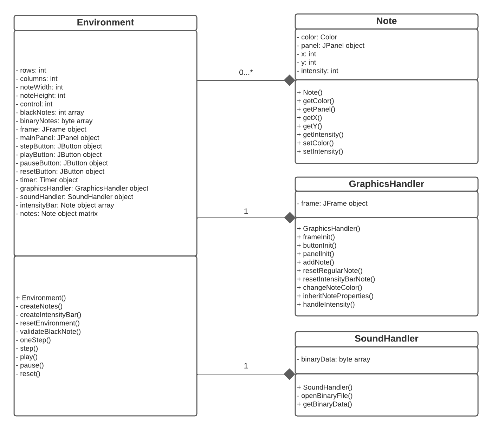

# Data structures design

The following UML diagram describes the data structure design that was implemented for the development of this app:

<center>

  

</center>

## Note

This class is used to encapsulate the necessary elements to adequately represent a note, both in its logical and graphical parts. The properties of this class store the JPanel to represent the note in the frame, the color of the JPanel, the x and y position in which the JPanel is going to be located and the intensity of the note. The Note class is implemented in Java as follows:

``` java
public class Note {
  private Color color;
  private JPanel panel;
  private int x;
  private int y;
  private int intensity;
}
```

## GraphicsHandler

This class is in charge of loading the graphic elements that are shown to the user on the screen and modifying their appearance during the execution of the app. It only has one property and it is the JFrame where all the other elements like panels and buttons are placed, for this purpose, this class inherits from the JFrame class. The GraphicsHandler class is implemented in Java as follows:

``` java
public class GraphicsHandler extends JFrame {
  private JFrame frame;
}
```

## SoundHandler

The purpose of SoundHandler class is to extract and handle the .poly file in order to interpret it and show it to the user. This class is implemented in Java as follows:

``` java
public class SoundHandler {
  private byte[] binaryData;
}
```

## Environment

Environment is the main class of the app, it takes care of all the logic and handling of files, arrays and matrices. This class has as properties all the graphic elements that are going to be used, variables that define the size of the matrix, arrays that store the information extracted from the binary files, variables that control the correct execution of the program and instances of classes to use as Timer, GraphicsHandler and SoundHandler. This class is implemented in Java as follows:

```java
public class Environment {
  private int rows;
  private int columns;
  private int noteWidth;
  private int noteHeight;
  private int control;
  private int[] blackNotes;
  private byte[] binaryNotes;
  private JFrame frame;
  private JPanel mainPanel;
  private JButton stepButton;
  private JButton playButton;
  private JButton pauseButton;
  private JButton resetButton;
  private Timer timer;
  private GraphicsHandler graphicsHandler;
  private SoundHandler soundHandler;
  private Note[] intensityBar;
  private Note[][] notes;
}
```

## Navegation

* [Main README](../README.md)